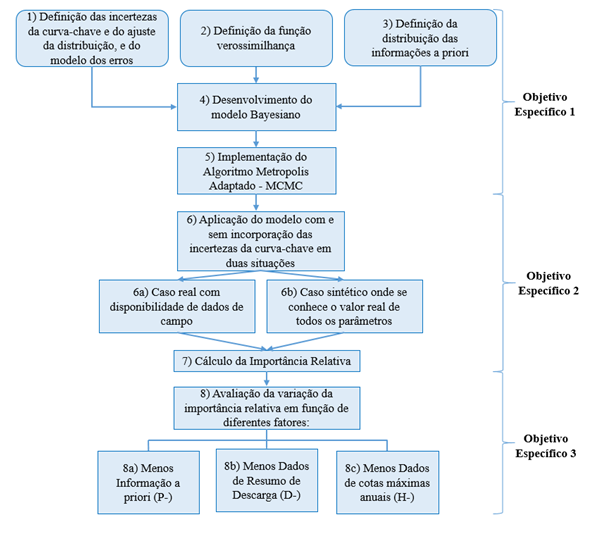
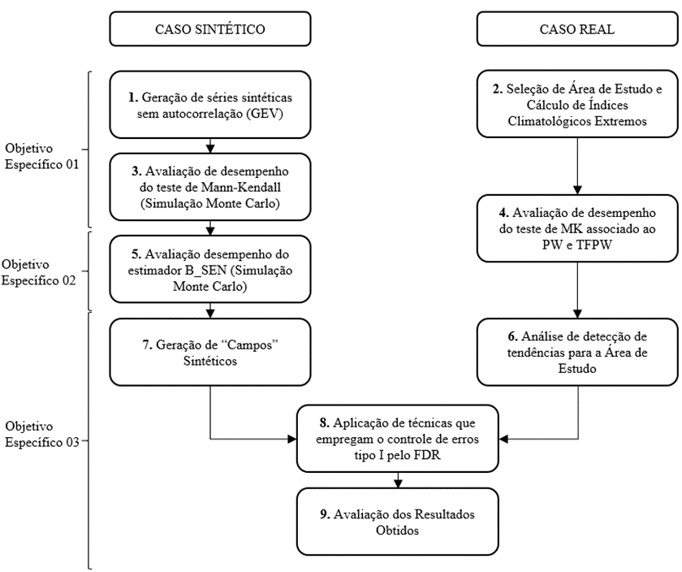

# Orientações para realização de Projeto Final

**Em construção!**

> Writing is nature's way of letting you know how sloppy your thinking is.
>
> Escrever é a maneira que a natureza tem para te mostrar o quão desordenado é seu pensamento.
>
> 
 por Dick Guindon 

Este documento de orientações inicia com essa citação do cartunista americano Dick Guidon para chamar a atenção para a importância da escrita num trabalho intelectual que exige reflexões constantes. A melhor forma de colocar seus pensamentos em ordem e avaliar se são dignos de serem levados a sério é colocando suas ideias no papel, mesmo que não haja papel algum. Pensar sem escrever é uma atividade perigosa para você mesmo. Apenas quando escrevemos nos damos conta dos problemas e limitações de nossos pensamentos.  Portanto, procure iniciar a escrita de seu documento do Projeto Final o quanto antes para evitar que você se autoengane por muito tempo. 

Disto isso, vamos ao que interessa.

Este documento apresenta e discute diversos elementos que fazem parte dos documentos de Projeto Final 1 e Projeto Final 2 de alunos da Univesidade de Brasília sob orientação do Professor Dirceu Silveira Reis Junior.

Essas orientações estão dividades em duas partes, uma exclusiva para o documento do Projeto Final 1, e outra que apresenta um detalhamento maior sobre os elementos necessários para o Projeto Final 2.

# Projeto Final 1

## Preliminares

Pontos (dicas) de como proceder:

- Comece a escrever o quanto antes. Não deixe para escrever o documento no final.
- Escrever é reescrever, o que sugere que você deve começar o quanto antes para que tenha tempo de apriomorar o texto e organizar as ideias na sua cabeça.
- Monte  uma itemização do documento utiliando a estrutura apresentada abaixo. A partir daí, comece a preecher os espaços vazios.Escrevo isso em tom de brincadeira, mas estou falando sério. Não tenha medo de escrever, mesmo que as primeiras versões sejam horrorosas. Todo bom texto que você já leu é resultado de aprimoramentos constantes de um texto inicial ruim. Confie em mim.
- Procure entender o problema que você e o seu orientador decidiram abraçar.
- Converse com o seu orientador sobre o trabalho semanalmente, se possível. É importante manter sua mente pensando no tema escolhido
- Leia com afinco o material repassado pelo seu orientador e procure discutir com ele os pontos que não ficaram claros.
- À medida que lê o material, procure escrever sobre o assunto sem voltar ao texto, como se tivesse tentando explicar o tema para um amigo seu. Esse exercício é essencial no processo de aprendizado.
- Se você é meu aluno, seu Projeto Final deve ter uma base quantitativa forte. Procure se familiarizar com as análise quantitativas do tema. Comece a escrever seus scripts já no Projeto Final 1. Isso ajudará no entendimento do tema.

## Estrutura do documento

### Introdução

Apesar do iniciarmos o documento com a Introdução, geralmente ela é a última seção do documento a ser finalizada. Depois de escrita uma vez, você voltará a ela várias vezes. Se não fizer isso, algo está errado no seu processo de construção do documento.

A Introdução de um documento de Projeto Final deve conter os seguintes elementos:

- Apresentação do problema e tentativa de convencer o leitor de que o tópico é importante. O balanço adequado entre uma apresentação dos aspectos gerais do tema e uma discussão com um certo grau de detalhamento de alguns componentes não é fácil de ser atingido. A relevância do tema pode ser explorada de várias formas, dependendo do Projeto Final. Custos, benefícios, pessoas afetadas, demanda governamental são exemplos de elementos que costumam ser utilizados para expressar a relevância do tema.    

- Descrição, ainda em caráter mais geral, do que vem sendo feito na literatura científica ou na prática da engenharia para abordar o problema em pauta. É importante aqui preparar o terreno na cabeça do leitor, identificando alguma lacuna metodológica ou dificuldade de aplicação prática, de modo que os objetivos propostos por você para este trabalho, a serem descritos na próxima seção do documento, sejam percebidos como algo necessário para tratar o problema (não necessariamente resolvê-lo). Pense nesta etapa da Introdução como uma forma de mostrar que atingir os objetivos propostos no seu trabalho é um passo coerente no avanço científico ou tecnológico.

- Depois de convencer o leitor de que o tema é importante, e de que há realmente lacunas a serem preenchidas, você precisa explicar o que pretende fazer no seu trabalho. É preciso deixar claro qual é a sua contribuição para a área de pesquisa ou para algum estudo de engenharia. O sucesso desta parte depende muito das duas etapas anteriores, principalmente em relação às lacunas existentes, já que são elas que justificam a execução do seu trabalho.

- Os três elementos discutidos acima são essencias numa Introdução, entretanto se você prentende abordar o tema utilizando um estudo de caso específico, o que é muito comum, é adequado apresentar os motivos e os critérios utilizados para tal escolha.

Embora não haja um número ótimo de páginas para a seção de Introdução, me arrisco a dizer que uma Introdução com menos de 3 páginas terá dificuldades em transmitir a relevânica do tema, caracterizar os desafos e lacunas do assunto, assim como descrever o que se deseja fazer, a não ser que o texto seja um primor de qualidade. Por outro lado, uma Introdução com mais de 5 páginas sugere que o tempo investido no processo de lapidação do texto foi curto. Eu uso a palavra lapidação para reprsentar aquel atividade penosa em se faz um esforço para deixar no papel apenas o que é essencial. 

Finalizo dizendo que a Introdução precisa estar muito bem casada com os Objetivos do seu trabalho, tema da próxima seção do documento. Definidos os Objetivos, vale sempre a pena voltar à Introdução para fazer as alterações necessárias.

### Objetivos geral e específicos

Eu inicio esta seção da mesma forma que finalizei a seção anterior, ou seja, enfatizando a necessidade de que a seção de Introdução deve estar intimamente relacioanada com a seção de Objetivos do trabalho. Ao iniciar a leitura dos Objetivos, o leitor não deve sentir nem uma gota de surpresa, muito pelo contrário, ele deve ler os objetivos como se os mesmos já estivessem em sua cabeça. Qualquer sinal de surpresa é um indício de que a Introdução pode e deve ser refinada.

Na UnB, mais especificamente no Departamento de Engenharia Civil e Ambiental, é comum apresentar os objetivos em duas partes. Na primeira parte, apresenta-se o Objetivo Geral, geralmente descrito em apenas um parágrafo, dando uma ideia geral do que se pretende alcançar com o Projeto Final. 

A segunda parte é composta pelos Objetivos Específicos, que são normalmente apresentados em forma de itens curtos. Não existe uma maneira única de pensar sobre como apresentar os Objetivos Específicos. Eu gosto de pensar nos Objetivos Específicos como subprodutos do Projeto Final, entidades palpáveis, que tenham vida própria, ou em outras palavras, que possam ser vistos como uma unidade com início, meio e fim. 

Cada Objetivo Específico, para ser alcançado, necessitará da realização de uma ou mais atividades. QUando pensar nesses objetivos, tente já pensar o que precisa ser feito para alcançá-los. Essa relação entre Objetivos Específicos e atividades será discutida mais profundamente quando falarmos da Metodologia.

O exemplo abaixo foi extraído do Projeto Final 2 de Mathieu Dias Girard, aluno do curso de Engenharia Ambiental da Universidade de Brasília. Acho que esse exemplo dá uma boa ideia do que geralmente se espera desta seção de Objetivos. A última frase do Objetivo Geral poderia ter sido modificada para deixar mais claro que objetivo incluía o uso das hipóteses de Budyko. Do jeito que ficou, parece que está misturando objetivo geral com metodologia.  

> 2 – OBJETIVOS
>
> 2.1 – OBJETIVO GERAL
>
> O presente trabalho objetiva estimar possíveis alterações na 𝑄95 decorrentes das mudanças
> climáticas na bacia hidrográfica do rio São Francisco. Para tal, foi desenvolvido um modelo
> estatístico de regressão que incorpora um modelo baseado nas hipóteses de Budyko.
>
> 2.2 – OBJETIVOS ESPECÍFICOS
>
> - Selecionar estações fluviométricas que não sofrem influência de reservatórios e cujo regime de vazões têm comportamento estatístico estacionário.
> - Analisar a sensibilidade da vazão média de longo período em relação às mudanças climáticas utilizando conceitos de elasticidade-clima aplicados à um modelo do tipo Budyko.
> - Construir um modelo estatístico que permita estimar a Q95 em função de covariáveis climáticas e da vazão média de longo período.
> - Determinar a mudança na 𝑄95 devido às mudanças climáticas com base no modelo estatístico, nos coeficientes de elasticidade-clima e nas mudanças relativas em variáveis climáticas apontadas em modelos climáticos globais apresentados pelo IPCC.

### Referencial teórico

### Revisão bibliográfica

Durante o Projeto Final 1, você passará um tempo considerável lendo material sobre o tema de seu trabalho. O orientador possui um papel primordial nesta etapa, discutindo com o aluno o que é fundamental entender e apresentando os documentos para a leitura, que geralmente consiste de artigos científicos, teses e dissertações, e até mesmo outros documentos de Projeto Final.

A seção de revisão bibliográfica tem o objetivo de descrever o estágio atual do conhecimento no tema do seu trabalho. Não é muito fácil falar sobre isso de uma forma geral, sem um caso específico, mas tentarei deixar claro o que se espera desta seção num documento de Projeto Final.

A descrição do estado atual do conhecimento deve cobrir Essa descrição Mas é preciso ter o cuidado para não perder o foco no seu problema específico. Alguns alunos exageram e começam a explicar tudo sobre o assunto. Por exemplo, não é raro encontrar em documentos de Projeto Final na área de modelagem hidrológica expicações sobre o balanço hídricos, que é um conhecimento básico e bastante geral. 

### Metodologia

##### Estratégia de ação

Da mesma forma que a Introdução precisa estar muito bem casada com os objetivos do trabalho, é muito importante que a Metodologia converse com os objetivos específicos da maneira mais clara possível. Para que isso aconteça, eu sugiro criar um item inicial na seção de Metodologia chamado **Estratégia de Ação**, ou algo similar, em que você irá descrever de uma forma geral como os métodos a serem apresentados se relacionam com os objetivos específicos do trabalho, utilizando, de preferência, algum tipo de diagrama ou fluxograma.

Para facilitar o entendimento de como isso pode ser feito, eu coloco abaixo dois exemplos de diagramas. Nesses dois exemplos, os retângulos representam atividades, e cada um dos objetivos específicos estão claramente relacinados com essas atividdes. Por exemplo, em Osorio (2017), pode-se observar que para alcançar o objetivo específico 1 é necessário realizar as atividades 1-5.      

<figure>
    
    <figcaption>Fonte: Osório (2017). MODELO BAYESIANO COMPLETO PARA ANÁLISE DE FREQUÊNCIA DE CHEIAS COM INCORPORAÇÃO DO CONHECIMENTO HIDRÁULICO NA MODELAGEM DAS INCERTEZAS NA CURVA-CHAVE. Dissertação de Mestrado, PTARH/UnB.</figcaption>
</figure>

<figure>
    
    <figcaption>Fonte: Amorim (2018). DETECÇÃO DE TENDÊNCIAS EM SÉRIES DE EXTREMOS HIDROLÓGICOS CONSIDERANDO EFEITOS DE AUTOCORRELAÇÃO TEMPORAL E MULTIPLICIDADE DE TESTES. Dissertação de Mestrado, PTARH/UnB.</figcaption>
</figure>

O uso de um fluxograma como esses dois acima apresentados em conjunto com um texto geral que explica o que precisa ser feito para lacançar cada objetivo específico costuma ser muito útil para o entendimento da lógica do trabalho. Veja que nessa primeira seção da Metodologia, nenhum detalhamento metodológico é realmente discutido. A lógica do item **Estratégia de Ação** é o de fornecer essa visão geral ao leitor.

Os itens seguintes da Metodologia devem discutir cada uma das etapas apreentadas no fluxograma. Aí sim é o momento de detalhar os métodos empregados. Nesta etapa, é preciso ter em mente que a seção de Metodologia tem o objetivo de mostrar como você executou o seu estudo. O nível de detalhamento a ser dado aqui deve ser aquele que permitirá, a quem quer que seja, reproduzir os seus resultados. 

##### Detalhamneto metodológico

É preciso pensar nisso quando for descrever os métodos empregados. Métodos antigos, às vezes já consagrados e utilizados por outros, já possuem publicações anteriores, que devem ser citadas aqui. Nesses casos, costuma-se descrever o métdo de uma forma mais geral sem dar os detalhes, que odem sempre ser obtidos em outras fontes. ENtretanto, vale dizer que o nível de detalhamento adequado é sempre um pouco subjetivo, de forma que existe a possiblidade que alguém da banca de avaliação de seu trabalho venha a discordar de sua opinião sobre o que é adequado de entrar no trabalho. Se o método empregado foi desenvolvido por você, o mesmo deve ser detalhado o suficiente para sua correta reprodução por terceiros.

É comum haver dúvidas de como escrever a Metodologia quando um método empregado já tenha sido discutido no **Referencial Teórico** ou na **Revisão Bibliográfica**. Nesse caso, eu sugiro apenas citar, pro exemplo, que a etapa A do trabalho empregou o método C, que já foi apresentado anteriormente. Seria um desperdício reescrever o método no memso documento. Entretanto, creio não existir consenso nesses casos.Se esse for o seu caso, sugiro conversar com o seu orientador a respeito para acharem uma solução conveniente. 

##### Dados empregados

Eu sugiro que o primiero item da Metodologia, depois do item **Estratégia de Ação**, seja reservado para tratar dos dados utilizados no estudo e dos possíveis tratamento dado aos mesmos. Digamos, por exemplo, que você tenha utilizado dados diários de vazão em várias estações fluviométrica localizados numa dada bacia hidrográfica. Nesse caso, é preciso explicar como e ond esses dados foram obtidos, listar os critérios adotados no processo de seleção dessas estações, mostrar a localização das mesmas num mapa, apresentar o período de dados usados, bem como discutir qalquer tipo de transformação que tenha sido empregada nos mesmos. 

### Resultados perliminares (se houver)

Alguns alunos conseguem obter alguns resultados preliminares antes da defesa do Projeto Final 1. Se for o caso, esses resultados devem ser incorporados no documento do Projeto Final 1. Sempre que possível, os resultados devem ser apresentados fazendo uma ligação com os objetivos específicos. 

Independete do quão preliminares os resultados são, eles devem ser analisados de forma coerente e aprsentados em forma de tabelas, gráficos ou mapas, dependendodo tipo de resultado que tenha sido alcançado. É comum os alunos voltarem a falar dos métodos emregados quando aprsentam os resutados obtidos. Isso deve ser evitado. O objetivo nesta seção do Projeto Final é apresentar os resultados e discutí-los da forma mais clara possível. 

### Cronograma de execução

O cronograma de execução apresentado no documento do Projeto Final 1 é um item muito importante que pode ajudar a banca a atender se o seu projeto é de fato viável de ser executado durante o Projeto Final 2. Além diso, um cronograma bem feito, baseado em reflexões concretas, pode ajudar você a organzar bem o seu tempo ao longo do semestre de forma a evitar correrias e estresse na semanas finais.

O cronograma deve conter todas as atividades apresentadas no item **Estratégia de Ação**. Para cada atividade, deve-se alocar um dada quantidade de tempo para sua execução. A discretização temporal deve ser uma ou duas semanas. Intervalos mensais devem ser evitados, pois não dão o detalhamento necessário para um projeto que deve ser concluído em 4 meses. 

### Referências

## Cuidados a serem tomados

# Projeto Final 2

## Preliminares

## Estrutura do documento

### Resumo

### Abstract

### Introdução

### Referencial teórico

### Revisão bibliográfica

### Metodologia

### Análise dos resultados

### Conclusões

### Referências

## Cuidados a serem tomados

# Cuidados com a reproducibilidade

## O conceito de reproducibilidde

Nos últimos anos, temos observado um movimento no meio científico para garantir a reproducibilidade dos estudos. O que é reproducibilidade e porque é algo desejável? Reproducibilidade é o nome que se dá ao fato de um estudo apresentar todos os detalhes metodológicos e os dados empregados para que outras pessoas possam reproduzir os resultados atingidos. Isso é muito importante, pois permite que terceiros possam não só reproduzir, de forma independente, o que foi obtido, como também avaliar cada passo que foi realmente realizado. Muitas vezes, infelizmente, o que os autores apresentam na Metodologia nem sempre é o que realmente foi feito no estudo.

QUal é a relação disso com um Projeto Final? Garantir a reproducibilidade num Projeto Final é uma forma de: (a) reduzir as chances do aluno publicar resultados errados no Projeto Final, dado que fica mais fácil para o orientador, ou colegas do mesmo grupo de pesquisa,  verificarem o que foi ou está sendo feito, (b) facilitar a vida do aluno e do orientador em relação às versões dos códigos empregados nas análises, dos dados utilizados, e até mesmo dos documentos gerados, e (b) facilitar o trabalho de futuros alunos que trabalharão no mesmo tema. 

Como garantir a reproducibilidade no Projeto Final e usfruir de seus benfícios é o assunto da próxima seção.

## Versionamento de dados e scripts

Com base no que foi dito na seção anterior, sugiro a utilização de ferramentas

- R e RStudio
- Git e GitHub

## Word ou RMarkdown?
